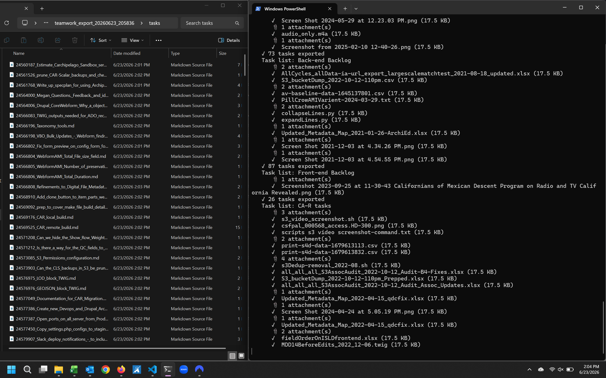
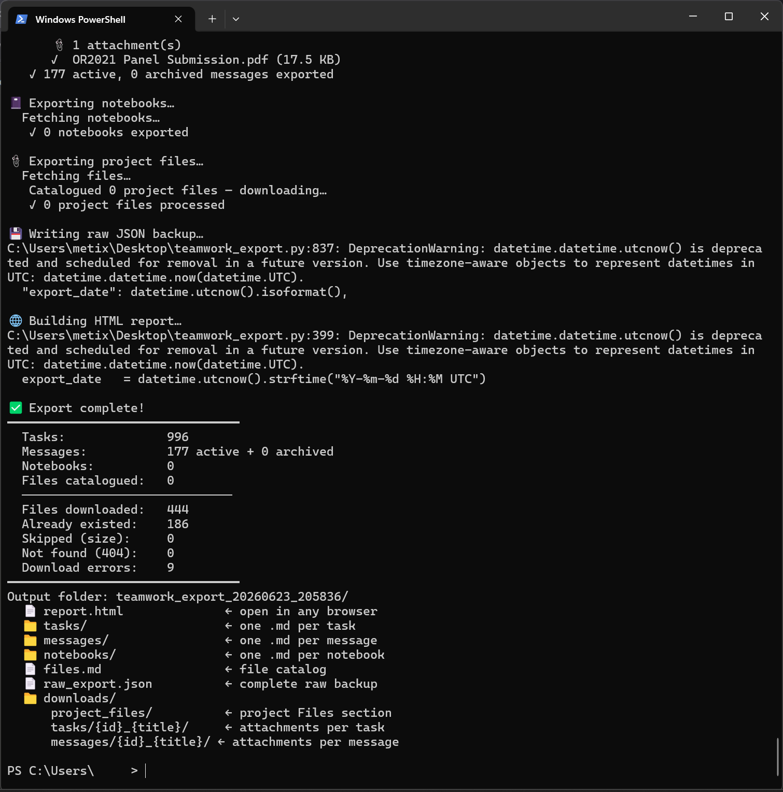
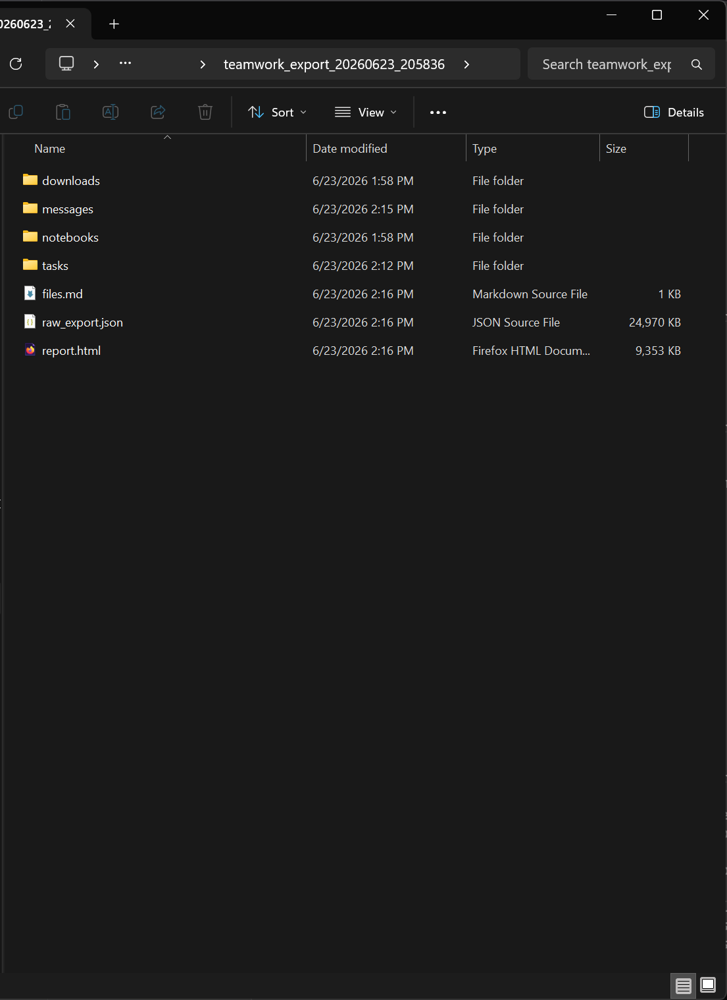

# teamwork-exporter

A Python tool to export everything from a [Teamwork.com](https://teamwork.com) project into a permanent local archive — useful when migrating away from the platform or preserving years of project history.

## Screenshots

**Tasks running with attachment downloads:**


**Export complete summary:**


**Output folder structure:**


## What it exports

- **Task lists** — both active and completed (see note below), with all tasks and comments
- **Messages** — active and archived, with all replies
- **Notebooks** — full content
- **Project files** — downloaded to `downloads/project_files/`
- **Task attachments** — downloaded per task to `downloads/tasks/{id}_{title}/`
- **Message attachments** — downloaded per message to `downloads/messages/{id}_{title}/`

## Output formats

Each run produces a timestamped folder containing:

| File / Folder | Contents |
|---|---|
| `report.html` | Single self-contained, searchable HTML report — open in any browser |
| `tasks/` | One `.md` file per task with all comments |
| `messages/` | One `.md` file per message with all replies |
| `notebooks/` | One `.md` file per notebook |
| `files.md` | Project file catalog |
| `raw_export.json` | Complete raw API backup for future migration |
| `downloads/project_files/` | Downloaded project files |
| `downloads/tasks/` | Downloaded task attachments, one subfolder per task |
| `downloads/messages/` | Downloaded message attachments, one subfolder per message |

## Requirements

```
pip install requests
```

Python 3.7+

## Usage

### Step 1 — Configure the export script

Edit the configuration block at the top of `teamwork_export.py`:

```python
API_KEY    = "YOUR_API_KEY_HERE"   # Teamwork → Edit Profile → API Keys
SITE_NAME  = "yoursite"            # subdomain of yoursite.teamwork.com
PROJECT_ID = "0000000"             # from your project URL

MAX_FILE_MB = 500   # skip files larger than this in MB (0 = no limit)

# Optional: hardcode completed task list IDs to skip auto-discovery (faster on re-runs)
# Leave as {} to always auto-discover.
COMPLETED_TASKLIST_IDS = {}
```

### Step 2 — Run the export

```
python teamwork_export.py
```

That's it. Completed task lists are **discovered automatically** — no separate step needed.

Large projects (1,000+ tasks) may take 20–30 minutes. The script rate-limits itself to avoid hitting Teamwork's API limits. File downloads are resumable — re-running skips already-downloaded files.

## Optional: pre-populate completed task list IDs

If you want to skip the auto-discovery sweep on future runs (slightly faster), run the discovery script once to find your completed task list IDs:

```
python teamwork_discover_completed_lists.py
```

Then paste the output into the `COMPLETED_TASKLIST_IDS` block in `teamwork_export.py`.

## Known limitations

- **Completed task lists are not discoverable via the Teamwork API.** This is a Teamwork API limitation. The script works around it automatically by inferring list IDs from completed task records, but it only finds lists that contain at least one completed task.
- **File downloads are resumable** but attachment download URLs require authentication — files cannot be downloaded without a valid API key.
- **Files larger than `MAX_FILE_MB`** are skipped and noted in the summary. Set to `0` for no limit.
- The Teamwork v1 API is used throughout. Tested against Teamwork.com hosted instances in 2025–2026.

## Getting your API key

Teamwork → click your profile avatar → **Edit Profile** → **API Keys** tab.

## License

MIT
